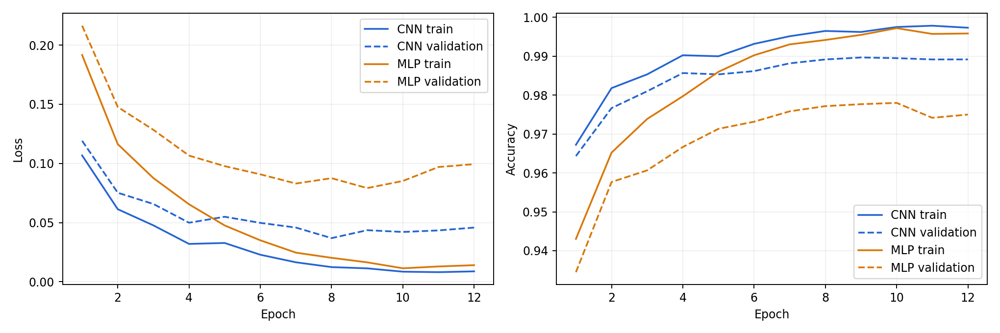
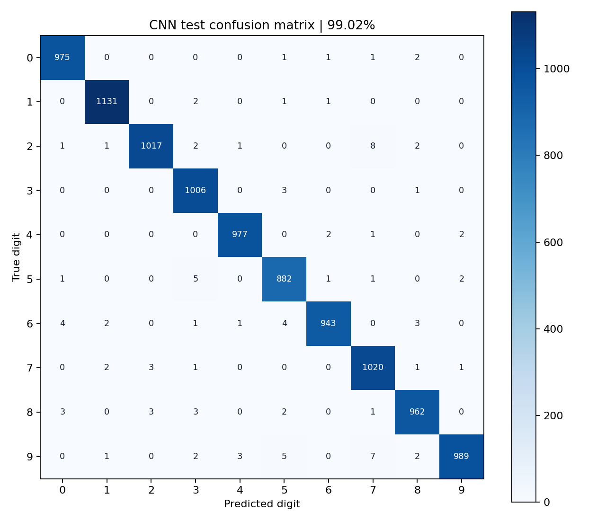
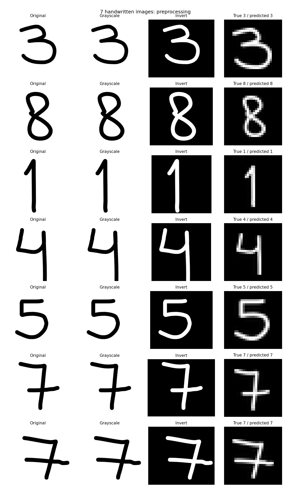
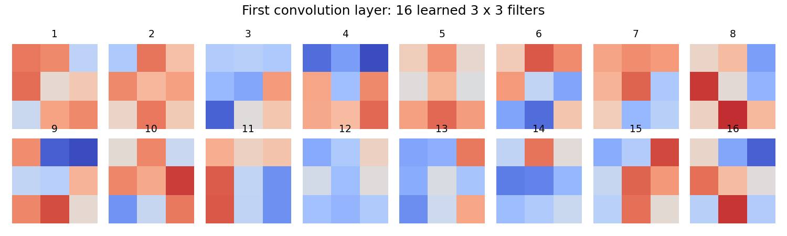

# Results

Both models ran for 12 epochs on the same split. Checkpoints were chosen by validation loss, not test accuracy.

| Model | Selected epoch | Test accuracy | Test loss |
|---|---:|---:|---:|
| CNN | 8 | 99.02% | 0.0297 |
| MLP | 9 | 97.92% | 0.0708 |

The CNN is 1.10 percentage points better in this run. Shared filters help it learn local shapes. The MLP treats the image as a flat vector. This is one seed, not proof that every run will give the same gap.

## Training curves

Final train/validation accuracy is 99.73%/98.92% for the CNN and 99.58%/97.50% for the MLP. The larger MLP gap and rising validation loss suggest overfitting. This is why the best validation checkpoint is used instead of the last one.

## Confusion matrices

Rows are true labels; columns are predictions. The CNN most often confuses **2 and 7**: eight 2 → 7 errors and three 7 → 2 errors. A weak bottom stroke in a 2 may make it look like a 7.

The MLP most often confuses **4 and 9**: seven 4 → 9 errors and ten 9 → 4 errors. Their upper shapes can look similar. These are possible explanations, not proven causes.

## Real handwriting: from image to 28 × 28

The saved CNN was reloaded in a separate script. These images were not used for training.

**Steps:** grayscale → invert dark ink → crop → resize to fit 20 × 20 while keeping the shape → center on a 28 × 28 canvas → divide pixels by 255.

| Image | True digit | First drawing | Redrawn image |
|---|---:|---:|---:|
| picture_1.png | 3 | 5 | 3 |
| picture_2.png | 8 | 1 | 8 |
| picture_3.png | 1 | 1 | 1 |
| picture_4.png | 4 | 4 | 4 |
| picture_5.png | 5 | 5 | 5 |
| picture_6.png | 7 | 7 | 7 |
| picture_7.png | 7 | 7 | 7 |

The first thin drawings scored **5/7**. After seeing these results, the digits were drawn again with thicker lines and scored **7/7**. The model did not change. Both line width and shape changed, so thickness alone cannot explain the improvement. This second attempt is not a blind test, and 7/7 does not mean 100% accuracy on all handwriting.

Current images are in `custom_images/`. The first scores remain in `artifacts/first_handwriting_results.json`; old image copies are not included in this compact version.

## Bonus: learned filters

These are the first layer's 16 learned 3 × 3 filters. Red shows positive weights and blue shows negative weights, on the same scale. They detect local patterns, not whole digits.
